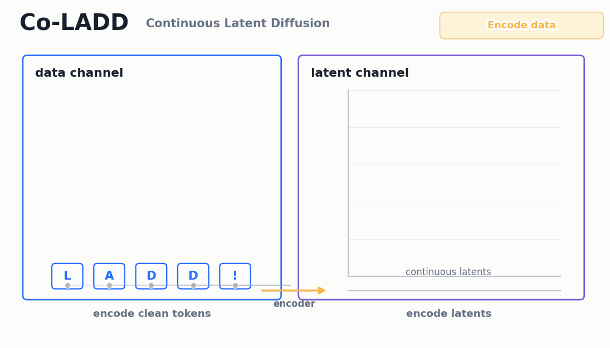
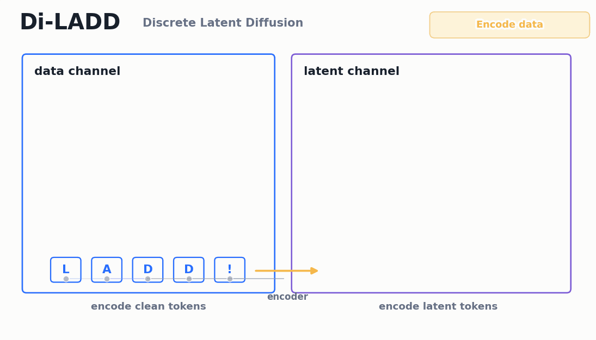

# Latent-Augmented Discrete Diffusion models (LADD)

<p align="center">
  
  
  <br>
  <em>Joint Co-LADD and Joint Di-LADD forward/backward processes.</em>
</p>

This is the official implementation of the paper [Latent-Augmented Discrete Diffusion Models](https://arxiv.org/abs/2510.18114). LADD augments masked discrete diffusion with an auxiliary latent channel, in order to improve generative performance in the few-step regime. The repository implements:

- **MDLM**: a masked discrete diffusion baseline over token sequences.
- **Co-LADD**: LADD with continuous latents from an encoder, diffused with a continuous process.
- **Di-LADD**: LADD with discrete latents from a vector-quantized encoder, diffused with a masked discrete process.

We implement the following datasets **Binsaw** (a simple low-dimensional binary sawtooth dataset), **text8**, **LM1B**, **OWT**, and, for the zero-shot experiments, **ptb, wikitext103, lambada, ag_news, pubmed, arxiv**.

## Installation

```bash
# Install dependencies
uv sync --no-install-package flash-attn
uv sync

# make sure to login huggingface and wandb
uv run huggingface-cli login
uv run wandb login
```

We conducted our experiments in the following environment: Python Version 3.12 and CUDA Version 12.3 H100.

## Developer notes

`CLAUDE.md` contains a fuller description of the codebase structure for developers working with coding assistants.

## Usage

### Pre-downloading models and datasets

Please run the following script to download datasets:
```bash
uv run python download_hf_dataset.py --datasets all
```

Please run the following script to download models:
```bash
uv run python download_pretrained_models.py --models all
```

For offline jobs, pre-download first and add `hf_offline=true` to the Hydra overrides. The code uses
`hf_cache_dir=./.hf_cache` by default; override it if your cache lives elsewhere.

### Running experiments

Experiments are configured with Hydra YAML files in `conf/experiments`. A run composes a dataset-level experiment
config with an optional variant. Here we give an example with OWT:

```bash
uv run python hydra_main.py \
  +experiments/owt=mdlm_train \
  +experiments/owt/variants=mdlm_bl

uv run python hydra_main.py \
  +experiments/owt=diladd_train \
  +experiments/owt/variants=diladd_lat64_cb8192_dim128
```

Models are checkpointed and evaluated every 20,000 steps by default.

Experiment YAMLs define the run type, dataset, model family, and log root. Variant YAMLs define reusable model-size or
latent-shape choices. Shared defaults live in files such as `conf/experiments/owt/_train_common.yaml`,
`conf/experiments/owt/_coladd_common.yaml`, and `conf/experiments/owt/variants/_diladd_common.yaml`.


**Local runs.** Prefer the dataset launch wrappers under `bash_commands/<dataset>/`. OWT MDLM and Co-LADD train in a
single run:

```bash
bash bash_commands/owt/experiment_train_local.sh \
  +experiments/owt=mdlm_train \
  +experiments/owt/variants=mdlm_bl

bash bash_commands/owt/experiment_train_local.sh \
  +experiments/owt=coladd_train \
  +experiments/owt/variants=coladd_lat64_adaptive
```

**Multi-GPU or multi-node.** Define the scheduler environment variables and launch with `srun` and
`torchrun`:

```bash
export NUM_GPUS=${NUM_GPUS:-8}
export NUM_NODES=${NUM_NODES:-1}
export MASTER_ADDR=${MASTER_ADDR:-$(hostname)}
export MASTER_PORT=${MASTER_PORT:-29500}

srun .venv/bin/torchrun \
  --nproc_per_node=${NUM_GPUS} \
  --nnodes=${NUM_NODES} \
  --node_rank=${SLURM_NODEID} \
  --rdzv_backend=c10d \
  --rdzv_id=${SLURM_JOB_ID} \
  --rdzv_endpoint=${MASTER_ADDR}:${MASTER_PORT} \
  hydra_main.py \
  num_gpu_devices=${NUM_GPUS} \
  num_nodes=${NUM_NODES} \
  +experiments/owt=mdlm_train \
  +experiments/owt/variants=mdlm_bl
```

**Offline jobs.** Pre-download datasets/models first and add `hf_offline=true` to the Hydra overrides.

**Approximate 1M-step training time.** The following estimates are H100-hours for one H100, `bf16-mixed`,
`torch_compile=default`, and the default effective batch size of 512 on OWT. They come from short post-compilation timing
probes with checkpointing, validation, and W&B disabled, so full runs can vary with I/O, validation cadence,
checkpoint cadence.

| Dataset | MDLM | Co-LADD-64 | Di-LADD-64 |
| --- | ---: | ---: | ---: |
| LM1B | 296 | 425 | 430 |
| OWT | 1,296 | 1,760 | 1,786 |

### Sampling from a checkpoint

Sampling/evaluation configs resume from the matching training log root by default. To sample from a specific run or
checkpoint, add `resume.from_dir=/path/to/run_or_parent` or `resume.ckpt_path=/path/to/checkpoint.ckpt`.

```bash
bash bash_commands/owt/experiment_sample_local.sh \
  +experiments/owt=coladd_sample \
  +experiments/owt/variants=coladd_lat64_adaptive

bash bash_commands/owt/experiment_sample_local.sh \
  +experiments/owt=diladd_sample \
  +experiments/owt/variants=diladd_lat64_cb8192_dim128
```

For zero-shot evaluation from OWT checkpoints, run `bash_commands/owt/zeroshot_mdlm.sh`,
`bash_commands/owt/zeroshot_coladd.sh`, or `bash_commands/owt/zeroshot_diladd.sh`. These scripts evaluate PTB,
WikiText-103, LM1B, LAMBADA, AG News, PubMed, and arXiv configs, and write logs and CSV metrics under
`logs/models/owt/zeroshot/...`. They accept the same trailing Hydra overrides as the sampling command above, so pass
`resume.from_dir=...` or `resume.ckpt_path=...` as needed. For offline runs, set shell variables such as
`HF_OFFLINE=true` and `HF_CACHE_DIR=...` before invoking the script.

### Outputs and checkpoints

Each run creates a timestamped directory under the configured log root:

```text
logs/models/<dataset>/<experiment_root>/<timestamp>_<config_tag>/
```

Inside a run directory:

- `checkpoints/` contains Lightning checkpoints. `last.ckpt` is saved when enabled, and periodic checkpoints follow the
  callback filename pattern in the experiment config.
- `configs/` contains the resolved Hydra config snapshots, including `composed_config.yaml`.
- `csv/version_*/metrics.csv` contains scalar training or evaluation metrics. This is the fastest way to inspect losses,
  validation metrics, and sampling/evaluation sweeps without opening W&B.
- `wandb_id.txt` stores the W&B run ID when W&B is enabled.
- `wandb/` contains the local W&B run files. For offline runs, sync with `uv run wandb sync <run_dir>/wandb/offline-run-*`.

Sampling/evaluation runs use their own log roots under paths such as `logs/models/owt/sampling/...`, so their CSVs are
separate from training CSVs. Prediction mode stores generated tensors under `logs/generated_samples/`.

## Examples

Below, we showcase uncurated generated samples from models trained on OpenWebText (OWT).

**MDLM**
```
s an open horizontal opening of the median opening to prevent bee emphyozence, meaning the fissured or rhizome makes for more honey."

In fact, giant pandas are far more squishping than their fishers are known to be. In theory, the possible case for the kind of mystique is full of holes: Originally, giant pandas were never made out of silk, and Chinese silk handles without a handle.

Alison Aleksand, a zoologist at the Smithsonian's National China Center in The Smithsonian, and two long colleagues think giant pandas may a developed a "nonpartite" capacity for concentrates."It's not as great with smaller doses as large rice pottery, speeds we've never reached," Ahdose says. "I'm here to preserve that complexity in the book."Since the Iraq Gulf war and its aftermath, I have frequently noticed that Israeli politics has increasingly disastrously preferred Israel, especially Iran for its ideological partners. The Republican Party is so sure on what they think of Israel that long-serving advisors, such as Robert Hagan and Colin Powell, wouldn't hurt the party by the president's actions. 

Unlike Iran policy, though, yet it seems that Netanyahu's his boss. For me, last week Netanyahu's job search (in a sense) best suited Israeli Benjamin Netanyahu. This made perfect sense given Netanyahu's mutual deference to some of Israel's friends and even the president involved with. But because of the 1995 Jerusalem accords, on the other hand, it's down to who Israel decides to rest on. With Iran stuck, and depending upon U.S. and Israeli policy there, to lay would make a choice is difficult.

The same goes for Netanyahu, but especially for U.S. policy there. Iran is probably fallen into a version of this. That's so because during the height of the 2006 invasion of Iraq, America's strategists feared that Obama's Panetta would be used as a tool of absolution from accountability for his shortcomings there. He intended to memorandize Iraq by 2008, perhaps making Iran go over it with some personal concessions. But that seems to have been canceled even if he faced a vigorous attack from someone more likely to keep his adept mouth shut blowing his nose.

And so to insist on warping Iran for geopolitics was against him. When his country was wildly hawk, Netanyahu had precious few choices. One cannot truly say what military he would not have had made the lengths to which he would pick Israel
```

**Co-LADD-64**
```
The changesal cars also are homes that provide passengers to gain more safety and access, while offering a number of courses that provide furtherance. The car driver can also help ease the day-to-day dealing with tasks that aren't important to the homeowner, and allows them to choose how to use the car to support their job.

People Who Take Traditional Home Ownership. In large part, many of their homes assume traditional ownership, and if buyers take taxes and loan to a lower or lower debt-extracting house, the majority of their homeownership will pay loan debt again. The IRS also allows users to store their income, whether it's an insurance or real estate loan. They may toss a dime into the homeowner's pocket for income, instead of pay back interest.

The Fed's attempts at promoting home ownership also become a factor. Many Fed-driven schemes change the way that consumer loans carry their money toward mortgage payments.

This may cause an eventual housing bubble, allowing more housing debt to trickle down to homeowners.

Real estate loans also help augment borrowing, increasing the household income stream, thereby adding the revenue available to finance various activities within the corporate and government sectors. While most non-owners required to write down mortgages have been homeowners, they have often taken decisions on an individualist basis. Simultaneously, does anyone imagine using their own assets to fund improvements, improving infrastructure, among other things?

Libertarian and mainstream government policy revel in shining how much upon the home and on the aggregate, ignoring that it is good for it. In fact, some conservative reformers believe that the government is encouraging homeowners to get its hands off their homes, because they are preventing them from getting into trouble. In fact, many libertarians believe-women should bother all the time with what is necessary, besides profit. This is the only way we have a fully competitive system from home to home, owing to the rigorous, sound, concerns about competition.

Libertarians would generally agree that government intrusion in the home industry as not so valuable to their interests, a result that it is to have government enter the mortgage business. Other triggers targeted by modern modern technology are swiping or checkout crawling practices, because homeowner's government enters their home when considering a mortgage. In fact, most homeowners have no mortgage policy because purchases are carried out in their home and then "off the books," until they obtain a new government license. In mainstream housing, frequently, the government accepts a loan from a group of homeowners that are serviced on the basis of loans in by the mortgage lender.

```


## Citation

```bibtex
@misc{shariatian2026latentaugmenteddiscretediffusionmodels,
      title={Latent-Augmented Discrete Diffusion Models},
      author={Dario Shariatian and Alain Durmus and Umut Simsekli and Stefano Peluchetti},
      year={2026},
      eprint={2510.18114},
      archivePrefix={arXiv},
      primaryClass={cs.LG},
      url={https://arxiv.org/abs/2510.18114},
}
```

## Acknowledgements

This repository builds off of the following works.

- [SGM](https://github.com/Stability-AI/generative-models)
- [SEDD](https://github.com/louaaron/Score-Entropy-Discrete-Diffusion)
- [MDLM](https://github.com/kuleshov-group/mdlm)
- [MD4](https://github.com/google-deepmind/md4)
- [GIDD](https://github.com/dvruette/gidd)

We are grateful for their work. We also thank [Makoto Shing](https://github.com/mkshing) for providing a first iteration of the codebase and further help and advice.
